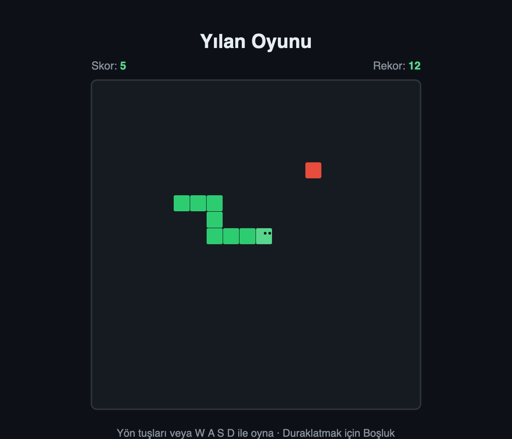

# 🐍 Yılan Oyunu

> HTML5 Canvas ve saf JavaScript ile yazılmış, sıfır bağımlılıklı klasik yılan oyunu.

[](https://tasocuk.github.io/snake-game/)
[](LICENSE)
[](https://developer.mozilla.org/tr/docs/Web/JavaScript)
[](#-kullanılan-teknolojiler)

Tarayıcıda çalışan, kurulum gerektirmeyen klasik yılan oyunu. Herhangi bir kütüphane ya da framework kullanmadan yalnızca HTML5 Canvas, CSS ve saf JavaScript ile geliştirildi.

## 🎬 Demo



🎮 **Canlı Demo:** [tasocuk.github.io/snake-game](https://tasocuk.github.io/snake-game/)

## ✨ Özellikler

- 🎮 Klavye kontrolü: yön tuşları veya `W A S D`
- ⏸️ Boşluk tuşu ile duraklat / devam et
- 🍎 Rastgele yem oluşturma (yılanın üstüne denk gelmez)
- 🏆 En yüksek skor `localStorage` ile kalıcı olarak saklanır
- 💥 Duvara ve kendine çarpma algılama
- 🔄 180° dönüş engeli (kendine anında çarpmayı önler)
- 📦 Sıfır bağımlılık, tek bir HTML dosyasıyla çalışır

## 🚀 Kurulum & Çalıştırma

Kurulum veya derleme adımı yoktur. Depoyu klonlayıp `index.html` dosyasını tarayıcıda açman yeterli:

```bash
git clone https://github.com/tasocuk/snake-game.git
cd snake-game
open index.html      # macOS
# Windows'ta:  start index.html
# Linux'ta:    xdg-open index.html
# veya dosyaya çift tıkla
```

Alternatif olarak canlı sürümü doğrudan tarayıcıdan oynayabilirsin: [tasocuk.github.io/snake-game](https://tasocuk.github.io/snake-game/)

## 📖 Kullanım

1. Herhangi bir yön tuşuna (veya `W A S D`) basarak oyunu başlat.
2. Yeme (kırmızı kare) ulaşarak yılanı büyüt ve skorunu artır.
3. Duvarlara ve kendi kuyruğuna çarpmaktan kaçın.
4. İstediğin an `Boşluk` tuşu ile oyunu duraklat / devam ettir.
5. Rekorunu kır — en yüksek skorun tarayıcında otomatik saklanır!

## 🛠️ Kullanılan Teknolojiler

- **HTML5 Canvas** — oyun alanının çizimi
- **Vanilla JavaScript (ES6+)** — oyun mantığı ve kontroller
- **CSS3** — arayüz ve tema
- **localStorage** — rekor kaydı

## 📁 Proje Yapısı

```
snake-game/
├── index.html      # Oyun sayfası ve arayüz iskeleti
├── style.css       # Tema ve düzen stilleri
├── game.js         # Oyun mantığı (Canvas, kontroller, skor)
├── docs/           # Ekran görüntüleri ve varlıklar
├── LICENSE         # MIT lisansı
└── README.md
```

## 📄 Lisans

Bu proje [MIT Lisansı](LICENSE) ile lisanslanmıştır. Dilediğin gibi kullanabilir, değiştirebilir ve paylaşabilirsin.

## 👤 Geliştirici

**Tahsin Karabulut**
GitHub: [@tasocuk](https://github.com/tasocuk)
